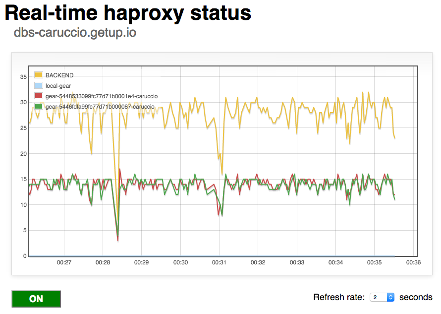

haproxy-monitor
===============

A simple, real-time haproxy status monitor for OpenShift applications.

Install
=======

Just serve the static file `haproxy-monitor.html` from inside your app and you are ready to go.

I recommend to rename it to index.html and drop inside some dir like `haproxy-monitor/index.html`, so you can access it in the same way you go for `haproxy-status` page.

Dependencies
============

Of course you need a scalable app here.
It uses [flot](https://github.com/flot/flot/) to plot the data and [jQuery](http://jquery.com/) for, you known... stuff...
